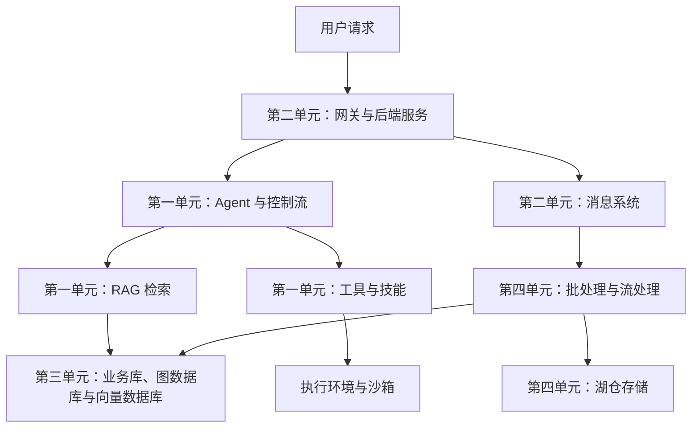

# 0-Overview：课程全景与知识脉络

> 课程：SE3353（CHP-fa26）。本笔记依据 `0-Overview/` 中的四份课程导览整理，重点记录课程结构、各讲关注的问题及知识之间的联系。技术名称与课程安排以提供的材料为准。

## 1. 课程整体结构

全课共 **4 个单元、32 讲**，围绕 AI 应用、服务端开发、数据基础设施和分布式计算展开。

| 单元 | 讲数 | 核心问题 | 能力目标 |
| --- | --- | --- | --- |
| 第一单元：AI 应用与辅助编程 | 8 | 如何让大模型获取上下文、调用工具并完成复杂任务？ | 将指令、检索、工具和控制流组合成 Coding Agent 平台 |
| 第二单元：现代服务端架构 | 10 | 如何承接并发请求，组织服务通信并保障数据一致性？ | 构建具有并发处理、事务、缓存和可观测性的后端服务 |
| 第三单元：数据基础设施 | 8 | 不同形态的数据应该怎样建模、存储、查询与扩展？ | 理解关系型与多类 NoSQL 数据库及其底层机制 |
| 第四单元：分布式框架与工具 | 6 | 如何在多机环境中运行系统、处理海量数据与实时事件？ | 理解容器、分布式存储、批处理、流处理与湖仓的协作 |

四个单元共同回答一个系统问题：**如何让 AI 能力建立在可运行、可扩展、可观测的数据与服务基础之上？**

## 2. 第一单元：AI 应用与辅助编程

### 2.1 核心思路

课件将大模型比喻为系统中的“非确定性虚拟 CPU”。工程重点是用结构化契约、工具接口、状态控制和运行隔离，约束模型行为，并将模型输出接入实际的软件系统。

学习主线：**规范表达 → 获取上下文 → 执行操作 → 自主决策与流程控制 → 平台集成**。

### 2.2 五层架构与八讲内容

| 层级 | 课程 | 重点内容 | 在系统中的作用 |
| --- | --- | --- | --- |
| 基础指令与契约层 | L1：指令工程 | XML 隔断、Prompt 三要素、Pydantic 强类型输出、防御性约束 | 明确输入、输出和行为边界 |
| 知识与协议扩展层 | L2：MCP 协议 | 上下文与工具的标准化暴露管道 | 连接模型与外部系统 |
| 知识与协议扩展层 | L3：企业 RAG | AST 代码切分、混合检索、事实锚定 | 为模型提供与任务相关的知识 |
| 原子执行与模式治理层 | L4：Function Calling | 强类型工具契约 | 将模型的调用意图接入具体操作 |
| 原子执行与模式治理层 | L5：Skill Network | Router、Fallback、Dry-Run、防腐层 | 组织、复用和约束工具能力 |
| 自主认知与控制编排层 | L6：智能体架构 | Brain/Body、ReAct、规划与记忆 | 组合感知、决策和行动 |
| 自主认知与控制编排层 | L7：控制流工程 | DCG 状态图、Checkpointer、沙箱 Harness | 管理执行状态、恢复与隔离 |
| 系统集成层 | L8：全栈架构与 Capstone | 微服务网关、沙箱、Tracing、CI/CD 评估、自动 PR 提交 | 将前七讲的组件组装成完整平台 |

### 2.3 关键承接关系

- **L1 → L2/L3**：先明确如何向模型表达任务，再补充外部上下文与知识。
- **L2/L3 → L4/L5**：在获取信息的基础上接入执行能力，并用路由、预演和中断机制约束操作。
- **L4/L5 → L6/L7**：将单次工具操作组织为多步任务，进一步管理决策、状态和执行环境。
- **L1～L7 → L8**：将组件接入网关、追踪和评估流程，形成可交付的平台。

需要区分各组件的职责：MCP 关注接入协议，RAG 关注检索知识，Function Calling 关注工具调用契约，Skill 关注能力组织，Agent 与控制流关注多步任务如何推进。

本单元的综合目标是构建能够**修改代码、运行单元测试并提交 PR** 的 Coding Agent 平台。结构化输出、状态图和沙箱分别提供不同层面的约束，不能仅凭这些组件就认定系统不会出错。

## 3. 第二单元：现代服务端架构与技术栈

### 3.1 四条知识主线

| 主线 | 对应课程 | 关注的问题 |
| --- | --- | --- |
| 计算与并发基础 | L1～L2 | 服务状态放在哪里？并发任务如何执行？ |
| 通信与事件驱动 | L3～L5 | 请求如何进入系统？服务间如何同步调用或异步协作？ |
| 数据、事务与检索 | L6～L9 | 如何保障数据一致性并提高访问效率？ |
| 云原生服务治理 | L10 | 如何统一部署、治理和观察整个系统？ |

### 3.2 十讲内容

| 课程 | 主题 | 重点知识 |
| --- | --- | --- |
| L1 | 云原生架构与分布式状态管理 | 单体、微服务、Serverless；无状态设计；Session/Token 管理 |
| L2 | Java 高并发与模型演进 | Java 内存模型（JMM）、J.U.C、无锁并发、平台线程与 Java 21 虚拟线程 |
| L3 | Web API 与 API 网关 | SOAP、RESTful、OpenAPI；路由、统一鉴权、限流、熔断和协议转换 |
| L4 | 高性能通信与实时交互 | gRPC、HTTP/2 多路复用、GraphQL、WebSocket、SSE |
| L5 | 事件驱动架构与消息中间件 | JMS、Kafka/Pulsar、零拷贝、Exactly-Once、CQRS 与事件溯源 |
| L6 | 数据库事务与并发控制 | ACID、MVCC、WAL、行锁、间隙锁与死锁防护 |
| L7 | 分布式事务与一致性 | CAP、BASE、最终一致性、Saga、TCC、Seata |
| L8 | 缓存与分布式内存数据库 | Redis、多级缓存、缓存雪崩与穿透、语义/向量缓存 |
| L9 | 海量数据与向量检索 | 倒排索引、Elasticsearch（ES）、向量数据库、RAG 混合检索 |
| L10 | 微服务与云原生治理 | Spring Cloud、Kubernetes、Service Mesh；日志、指标与分布式追踪 |

### 3.3 从请求生命周期理解后端

可以沿着一个请求梳理知识之间的联系：

1. 客户端通过 API 网关进入系统，完成路由、鉴权与流量控制。
2. 服务使用并发执行模型处理任务，并按需要调用其他服务。
3. 可以异步处理的工作通过消息系统传递给消费者。
4. 业务根据访问需求使用缓存、搜索引擎和事务数据库。
5. 部署治理与可观测性贯穿上述过程，帮助定位性能和可靠性问题。

这是理解架构的示意路径；具体请求会按业务需要选择组件，不必依次经过所有中间件。

与第一单元的联系尤其体现在：网关承接 AI 服务入口，SSE 支撑流式响应，检索服务提供 RAG 上下文，消息系统承接异步任务，Tracing 串联多步执行过程。

## 4. 第三单元：数据基础设施

### 4.1 学习主线

**关系理论与建模 → 单机存储调优 → 高可用与扩展 → 多种数据模型 → 存储引擎 → 向量检索**。

这一顺序用于建立知识联系。理解各类数据库时，应同时关注数据形态、读写模式、查询需求和扩展方式。

### 4.2 八讲内容

| 课程 | 主题 | 重点知识 | 主要关注的问题 |
| --- | --- | --- | --- |
| L1 | 关系数据库理论与范式 | 数据依赖、第一至第四范式、正则覆盖、反范式化、零停机 Schema 变更 | 数据如何建模，结构如何演进？ |
| L2 | InnoDB 与 B+Tree 索引 | EXPLAIN、Buffer Pool、Change Buffer、TempTable/Redis | 如何理解执行计划与单机访问瓶颈？ |
| L3 | MySQL 恢复、高可用与 NewSQL | PITR、GTID 主从、MHA/Orchestrator、TiDB/PolarDB | 如何恢复数据、保障可用性并扩展容量？ |
| L4 | MongoDB 文档数据库 | Document Model、WiredTiger、聚合管道、分片、Change Streams | 如何组织和查询半结构化数据？ |
| L5 | Neo4j 图数据库与 GraphRAG | 属性图、Cypher、图算法、知识图谱 | 如何表达和查询复杂关系？ |
| L6 | InfluxDB 时序数据库 | 高频追加、Arrow/Parquet、降采样、IoT 数据治理 | 如何处理持续产生的时间序列？ |
| L7 | RocksDB 与 LSM-Tree | B+Tree/LSM-Tree 对比、MemTable、SSTable、WAL、Compaction | 高写入吞吐背后的存储机制是什么？ |
| L8 | 向量数据库与 AI 召回 | Embedding、HNSW、IVF-PQ、Milvus/Pinecone、BM25 + 向量检索 | 如何组织语义检索与混合召回？ |

### 4.3 与其他单元的联系

- **事务与存储**：第二单元从业务一致性角度讨论事务，第三单元进一步进入数据库建模、索引与引擎机制。
- **RAG 与检索**：第一单元关注检索如何服务模型，第三单元关注向量、图和混合检索所依赖的数据基础设施。
- **LSM 与分布式系统**：第三单元的 LSM-Tree 知识连接第四单元的 HBase 存储机制和 Flink 状态后端。
- **业务数据与分析数据**：业务库中的变化可以进入后续的数据处理管道，支撑湖仓、特征与检索数据的更新。

## 5. 第四单元：分布式框架与工具

### 5.1 六讲全景

| 课程 | 主题 | 核心问题 | 重点知识 |
| --- | --- | --- | --- |
| L1 | 容器化与现代运行时 | 如何统一环境并隔离运行资源？ | Namespace、Cgroups、OverlayFS、镜像分层、多阶段构建、OCI、Containerd/CRI-O、Wasm |
| L2 | Hadoop 与现代湖仓 | 如何进行分布式分治、资源调度和海量数据管理？ | MapReduce、Shuffle、YARN、Hive、Iceberg、Delta Lake、Paimon |
| L3 | Spark 分布式批处理 | 如何组织大规模计算与语料清洗？ | RDD、Partition、Lineage、宽窄依赖、DAG、Stage、Shuffle、数据倾斜、Catalyst、Tungsten、Spark Connect |
| L4 | Storm 与流处理演进 | 如何理解持续事件处理及其可靠性问题？ | 无界数据流、Spout/Bolt、Topology、Acker、At-Least-Once、微批与事件流对比 |
| L5 | HDFS 与 HBase | 如何持久化海量数据并支持宽表访问？ | NameNode/DataNode、副本、对象存储对比、MemStore、WAL、HFile、Compaction、RowKey 热点治理 |
| L6 | Flink 状态流与实时湖仓 | 如何处理乱序事件、维护状态并在故障后恢复？ | Event Time、Watermark、迟到侧输出、Checkpoint、2PC、RocksDB 状态后端、Flink SQL、Paimon、CEP |

### 5.2 按系统职责理解技术关系

- **运行环境**：容器为分布式任务提供一致的运行环境和资源隔离机制。
- **资源调度与存储**：Hadoop 相关组件建立分治、调度和持久化的基础；湖仓课程进一步讨论表格式、事务与元数据管理。
- **批处理**：Spark 关注大规模数据处理、SQL 分析和 AI 语料 ETL，重点理解任务划分、Shuffle 与执行优化。
- **流处理**：从 Storm 的事件拓扑出发，逐步关注状态管理、事件时间、乱序处理和故障恢复。
- **在线数据访问**：HBase 课程关注宽表存储、点查以及 RowKey 设计带来的访问分布问题。
- **实时集成**：Flink 将事件处理、状态、实时指标、风控和湖仓数据更新联系起来。

复习时应特别关注“发生故障后如何恢复”这一问题：Spark 的 Lineage、消息处理可靠性机制以及 Flink 的状态快照，分别在不同的执行模型中讨论恢复能力。

## 6. 四个单元如何组成一个系统

下面以课程涉及的 **AI 应用与实时数据管道** 为例，归纳四个单元的协作关系。这是用于理解的组合示意，不是必须照搬的部署方案。

跨单元复用的知识主要有：

| 知识线索 | 跨单元联系 |
| --- | --- |
| RAG 与数据更新 | 第一单元使用检索结果；第三单元提供检索存储；第四单元处理语料和实时数据 |
| 事件驱动 | 第二单元的 Kafka/Pulsar 连接服务事件与第四单元的流处理任务 |
| 状态管理 | Agent 执行状态、服务状态、数据库状态和流计算状态，都需要明确保存、更新与恢复方式 |
| 一致性与故障恢复 | 数据库事务、分布式事务、消息处理语义与流处理快照，从不同层面讨论故障下的结果 |
| 运行与治理 | 第一单元的执行沙箱、第二单元的服务治理和第四单元的容器运行环境共同支撑系统运行 |
| 可观测性 | Agent 工具调用、后端请求和数据处理任务需要能够追踪和定位问题 |

## 7. 复习与后续学习问题

1. 一个 AI 应用从“回答问题”发展到“执行任务”，需要增加哪些组件？
2. MCP、RAG、Function Calling、Skill 和 Agent 分别负责什么？
3. 一次后端请求的性能瓶颈，可能出现在哪些计算、通信和数据访问环节？
4. 面对新的数据需求，如何从数据形态、访问模式和一致性要求分析存储方案？
5. 批处理和流处理在任务执行、状态管理与故障恢复上有哪些差异？
6. “Exactly-Once”讨论的边界是什么？如何结合具体的输入、处理和输出组件分析？
7. 如果搭建一个自动修复代码的平台，四个单元各自提供哪些能力？

后续每讲的笔记可以围绕五个问题展开：**解决什么问题、核心抽象是什么、依赖哪些机制、有哪些取舍、失败后如何定位与恢复**。

## 8. 原始材料

- [第一单元：AI 应用与辅助编程（8 讲）](0-Overview/A1-8.html)
- [第二单元：服务端开发（10 讲）](0-Overview/B1-10.html)
- [第三单元：数据基础设施（8 讲）](0-Overview/C1-8.html)
- [第四单元：分布式框架与工具（6 讲）](0-Overview/D1-6.html)
