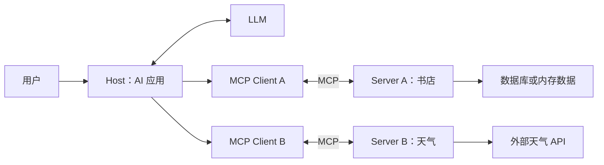

# A2-MCP：模型上下文协议与工程实践

> 课程：SE3353（CHP-fa26）。本笔记依据 `A2-MCP/1.html`～`46.html` 及同目录的 Python、Java 示例整理，按主题归纳，补充代码阅读与复习要点。协议细节以明确标注的 **MCP 2025-06-18 规范**核对，用于解释课件所采用的模型，不代表最新版本的全部特性。SDK 写法需匹配项目依赖；课件中的性能倍数、伪代码和配置示意不作为通用保证。

## 1. 本讲主线与知识地图

本讲回答：**如何让不同 AI 应用以统一方式发现和使用外部数据、工具与提示模板？**

上一讲解决“怎样表达任务并形成工具反馈闭环”；这一讲进一步解决“外部能力怎样接入”。MCP（Model Context Protocol，模型上下文协议）的价值在于标准化接口与交互流程。

| 模块 | 课件页码 | 核心问题 |
| --- | --- | --- |
| 背景与参与者 | 1～7 | 为什么需要标准协议？Host、Client、Server 如何分工？ |
| 传输、消息与生命周期 | 8～13 | 怎样传递请求、协商能力、处理错误与权限？ |
| 三类核心原语 | 14～21 | Resources、Tools、Prompts 分别提供什么？ |
| Python / FastMCP | 22～28 | 如何注册能力、处理异步 I/O、调试和测试？ |
| Java / Spring AI | 29～38 | 如何复用业务 Bean、部署、监控与整合多个 Server？ |
| AI 协作开发 | 39～43 | 如何用架构约束与证据验证生成代码？ |
| 实验与总结 | 44～46 | 如何实现教务系统和旧业务系统接入？ |

学习路径：**集成痛点 → 标准契约 → 能力发现 → 参数校验 → 业务执行 → 结果反馈 → 工程验证。**

## 2. MCP 解决什么问题

### 2.1 从 N×M 适配到统一协议

LLM 的已有知识不能直接提供最新库存、私有课程表、本地文件或企业业务状态。应用需要访问数据库、文件系统和外部 API。

如果有 N 个 AI 应用、M 类外部系统，每对系统都单独开发适配，最多需要维护 N×M 组连接逻辑。采用公共协议后，可以让 N 个应用实现客户端接入，M 类能力实现服务端暴露，形成近似 N+M 的适配结构。

这是**接口复用的架构收益**，不是严格的工时复杂度结论。认证、业务语义、版本兼容、权限和部署仍然需要实现。

### 2.2 与 Prompt、Function Calling、ReAct 的关系

| 概念 | 主要职责 | 在一次任务中的位置 |
| --- | --- | --- |
| Prompt / 上下文工程 | 表达目标、约束与相关材料 | 告诉模型要解决什么问题 |
| Function Calling | 让模型输出工具名称及结构化参数 | 产生调用意图 |
| ReAct / Agent 控制循环 | 组织决策、执行、观察和继续求解 | 根据工具结果推进任务 |
| MCP | 标准化外部能力的发现与交互 | 把具体服务接入应用 |

典型流程是：用户提出问题，Host 向模型提供可用能力，模型提出工具调用，Host 校验与授权后，经 MCP Client 请求 Server，Server 执行业务逻辑并返回结果，模型再据此回答。

**模型提出调用不等于模型直接执行；接入 MCP 也不等于自动拥有完整 Agent。**

## 3. Host、Client、Server 与分层

### 3.1 三类参与者

| 参与者 | 职责 | 例子 |
| --- | --- | --- |
| Host：宿主 | 用户交互、模型调用、上下文组织、权限策略，管理多个 Client | IDE、聊天应用、Agent 应用 |
| Client：客户端 | 管理与一个 Server 的协议连接、初始化和消息收发 | Host 内部的 MCP 连接组件 |
| Server：服务端 | 暴露 Resources、Tools、Prompts，访问底层业务系统 | 数据库服务、文件服务、天气服务 |



课件中的“1:1”指一个 Client 管理与一个 Server 的连接；一个 Host 可以管理多个 Client。远程 Server 可以服务多个客户端，不能理解成整个 Server 只能接待一个用户。

### 3.2 分层理解

- **业务能力层**：工具、资源与提示模板的定义和业务实现。
- **协议消息层**：JSON-RPC 消息、能力声明和生命周期。
- **传输层**：通过 STDIO 或 HTTP 等机制收发消息。
- **底层依赖**：操作系统、进程、数据库、网络和外部 API。

课件使用 OSI 类比帮助理解职责，MCP 并不是 OSI 七层协议的逐层实现。更换传输方式时，业务函数可以复用，但部署、认证与连接管理会变化。

## 4. 传输、JSON-RPC 与生命周期

### 4.1 STDIO 与 HTTP

| 方式 | 工作方式 | 学习重点 |
| --- | --- | --- |
| STDIO | Client 启动子进程，通过标准输入和输出交换消息 | 常用于本地接入；进程命令、工作目录和日志输出都影响连接 |
| 旧式 HTTP+SSE | 通过 HTTP 发送消息，借助 SSE 接收服务端事件 | 阅读旧课件或适配旧实现时需识别 |
| Streamable HTTP | 通过 MCP HTTP 端点交互，响应可为 JSON 或 SSE 流 | 本目录 Python 书店示例采用此模式 |

STDIO 中，**stdout 只能输出协议消息，调试信息写入 stderr**。HTTP 模式下，响应可能是事件流，不能假设所有响应都能直接用 `response.json()` 读取。Streamable HTTP 在 2025-06-18 规范中取代旧式 HTTP+SSE；SSE 本身是服务端到客户端的事件流，不是独立的双向协议。参见[传输规范](https://modelcontextprotocol.io/specification/2025-06-18/basic/transports)。

```python
import sys

# 本地 STDIO Server 的诊断输出示意
print("正在连接数据库", file=sys.stderr)
```

### 4.2 JSON-RPC 2.0 的三种消息

| 消息 | 关键字段 | 含义 |
| --- | --- | --- |
| Request | `jsonrpc`、`id`、`method`、可选 `params` | 发起请求，等待响应 |
| Response | `jsonrpc`、`id`，以及 `result` 或 `error` | 与对应请求匹配，成功和错误二选一 |
| Notification | `jsonrpc`、`method`、可选 `params`，无 `id` | 单向通知，不等待响应 |

不能把 `method`、`params`、`result` 都视为每条消息必备的字段。请求 ID 用于匹配响应，不应直接当成跨服务的 Trace ID。

一次书籍查询的请求示意：

```json
{
  "jsonrpc": "2.0",
  "id": 7,
  "method": "tools/call",
  "params": {
    "name": "search_books",
    "arguments": { "query": "Orwell" }
  }
}
```

相应的文本结果示意：

```json
{
  "jsonrpc": "2.0",
  "id": 7,
  "result": {
    "content": [
      { "type": "text", "text": "找到 Animal Farm，库存 14。" }
    ],
    "isError": false
  }
}
```

这是用于理解封装层次的消息示意，不是对本地 SDK 实际序列化输出的运行记录。

### 4.3 生命周期与能力协商

```text
Client                           Server
  | -------- initialize --------> |
  | <--- 版本、能力、实现信息 ------ |
  | -- notifications/initialized > |
  | -------- 正常业务请求 --------> |
  | <-------- 结果或通知 ---------- |
  | ------ 通过传输机制关闭 ------- |
```

初始化用于确认协议版本与双方支持的功能。`tools.listChanged` 表示支持工具列表变化通知，`resources.subscribe` 表示支持资源订阅；不能仅因认识某个功能名称就假定对端已实现。

**课件第 11 页需修正**：就绪通知由 Client 发送，完整方法名为 `notifications/initialized`。本笔记所依据的规范没有定义通用 `shutdown`、`exit` RPC；关闭由底层传输处理。能力协商也不等于身份认证。参见[生命周期规范](https://modelcontextprotocol.io/specification/2025-06-18/basic/lifecycle)。

### 4.4 错误处理

课件列出的 JSON-RPC 错误码：

| 错误码 | 含义 |
| --- | --- |
| `-32700` | 无法解析 JSON |
| `-32600` | 请求对象不合法 |
| `-32601` | JSON-RPC 方法不存在 |
| `-32602` | 方法参数不合法 |
| `-32603` | 内部错误 |
| `-32000`～`-32099` | 预留的服务端错误范围 |

还应区分**协议错误**与**工具执行失败**：前者使用 JSON-RPC `error`；工具已开始执行但业务或外部依赖失败时，可以通过 `result.isError: true` 返回可理解的错误。`tools/call` 方法存在但工具名称错误，与 JSON-RPC 方法不存在不是同一层问题。参见[工具错误处理规范](https://modelcontextprotocol.io/specification/2025-06-18/server/tools#error-handling)。

好的错误信息应说明失败类型与可采取的下一步，同时避免泄露凭据。没有查询结果、数据库连接失败、用户无权查询应分别表达；不要统一返回空列表掩盖故障。

## 5. 三类核心原语：Resources、Tools、Prompts

### 5.1 对照表

| 原语 | 回答的问题 | 典型内容 | 常见交互方法 |
| --- | --- | --- | --- |
| Resources | 有什么上下文可读取？ | 文件、成绩报告、数据库记录 | `resources/list`、`resources/templates/list`、`resources/read` |
| Tools | 有什么操作可执行？ | 检索、计算、写入、发送通知 | `tools/list`、`tools/call` |
| Prompts | 有什么任务模板可复用？ | 代码评审、报告生成、领域分析模板 | `prompts/list`、`prompts/get` |

规范中通常将 Resources、Tools、Prompts 分别描述为应用、模型、用户驱动，但具体 UI 和调度方式由应用实现。参见 [Resources](https://modelcontextprotocol.io/specification/2025-06-18/server/resources)、[Tools](https://modelcontextprotocol.io/specification/2025-06-18/server/tools)、[Prompts](https://modelcontextprotocol.io/specification/2025-06-18/server/prompts)。

### 5.2 Resources：可寻址的上下文

资源通过 URI 标识。例如 `grades://20260001` 表示某个学生的成绩报告；`grades://{student_id}` 是资源模板。

**列出模板不等于列出所有实例。** 客户端发现模板后，构造具体 URI，再请求读取。URI 是协议层标识，不要求直接对应一个磁盘路径，也不要求使用 HTTP。

资源读取适合提供上下文，但“只读”仍可能泄露敏感数据。服务端需要检查调用者能否读取该学生的成绩，而不只是检查 `student_id` 的格式。

### 5.3 Tools：可执行能力

Tools 可以有副作用，也可以只读。书店的 `search_books` 和天气查询都是只读 Tool，因此不能用“是否修改数据”作为区分 Tool 与 Resource 的唯一标准。

可从交互语义判断：

- “读取这份已标识的报告”更适合 Resource。
- “按若干条件完成检索、计算或动作”更适合 Tool。
- 同一底层数据可以由不同原语提供不同访问方式。

工具的名称、描述、参数类型和边界共同构成契约。描述应交代适用场景、单位、允许范围与副作用；仅写“执行操作”无法帮助模型准确选择。

### 5.4 JSON Schema：结构契约

```json
{
  "name": "find_rooms",
  "description": "查询指定教学楼中满足容量条件的空闲教室",
  "inputSchema": {
    "type": "object",
    "properties": {
      "building": { "type": "string", "description": "教学楼编号" },
      "min_capacity": { "type": "integer", "minimum": 1 }
    },
    "required": ["building", "min_capacity"],
    "additionalProperties": false
  }
}
```

Schema 能表达字段、类型和范围，服务端仍需实际执行校验。结构合法不代表教学楼存在，也不代表调用者有权限使用相关资源。

**类型约束、业务校验和授权是三个不同层次。** Python 类型注解与 `Field` 能帮助框架生成描述，但不能替代完整的业务检查。

### 5.5 Prompts：可复用任务模板

Prompt 可以封装任务角色、输入参数、步骤和输出格式，例如“按课程生成复习提纲”或“按语言生成代码审查指引”。客户端获取模板后，由 Host 决定如何纳入模型上下文。

获取 Prompt 本身不等于模型已经执行任务。服务端返回的提示模板也不会天然获得系统指令的权限等级。

### 5.6 进度与日志

长任务可使用 `notifications/progress`，通过 `progressToken` 关联请求，携带当前进度与可选总量。进度值不天然等于百分比，只有约定总量后才能计算百分比；请求方需提供用于跟踪的令牌。参见[进度规范](https://modelcontextprotocol.io/specification/2025-06-18/basic/utilities/progress)。

协议日志使用 **`notifications/message`**，不是课件第 20 页的 `notifications/logging`。协议日志与进程 `stderr` 是不同通道；前者供协议客户端接收，后者适合进程启动与本地诊断。参见[日志规范](https://modelcontextprotocol.io/specification/2025-06-18/server/utilities/logging)。

## 6. Python / FastMCP 开发

### 6.1 从函数到 MCP 能力

课件使用独立 `fastmcp` 包：

```python
from fastmcp import FastMCP

mcp = FastMCP("EduSystem")

@mcp.tool()
def get_schedule(student_id: str) -> str:
    """根据学生编号查询课表；教学示例返回模拟数据。"""
    return f"{student_id}: 周三 10:00 软件工程"

@mcp.resource("grades://{student_id}")
def student_grades(student_id: str) -> str:
    return f"# {student_id} 成绩报告\n\n- 软件工程：A\n"

@mcp.prompt()
def study_plan(course: str) -> str:
    return f"请为 {course} 制定复习计划，列出知识点、自测题与时间安排。"

if __name__ == "__main__":
    mcp.run()
```

这是演示三类注册方式的骨架，没有真实数据库或身份校验。FastMCP 将函数元数据与处理逻辑接入协议，具体序列化和启动参数取决于安装版本。参见 [FastMCP Quickstart](https://gofastmcp.com/getting-started/quickstart)。

课件中的 `uv init`、`uv add fastmcp`、`uv run main.py` 分别表达建立项目、管理依赖、在项目环境中运行的工作流。实践应保存依赖声明与锁文件，不把某次演示的安装耗时或提速倍数视为普遍结论。

### 6.2 异步 I/O 的意义

MCP 服务需要在等待数据库或网络时继续处理其他工作。异步代码的关键是让出事件循环：

```text
收到请求 → 发起外部 I/O → await 等待 → 事件循环处理其他任务 → I/O 完成后继续
```

注意三个边界：

1. `async def` 内直接调用同步数据库驱动仍可能阻塞事件循环。
2. CPU 密集计算不会因为加上 `await` 自动变快，需要适当的执行器或独立任务系统。
3. 同步函数是否阻塞整个服务取决于框架调度方式，不能一概断言；框架可能将其放入线程池。

工程上还需设置超时、限制并发、正确关闭连接，并让取消和失败能够传播。

### 6.3 调试与测试

先验证 Server，再集成 Host，可以区分业务错误与配置错误：

1. 检查进程是否启动，解释器、依赖和工作目录是否正确。
2. 验证初始化和能力声明。
3. 列出工具、资源、模板，检查描述与参数。
4. 调用正常样例，再测试缺参、越界、无权限和下游超时。
5. 最后在真实 Host 中检查发现、调用与结果展示。

官方 Inspector 的命令入口是：

```bash
npx @modelcontextprotocol/inspector
```

可以在界面中选择传输并配置目标。课件中的 `uvx mcp-inspector` 不应直接当作官方 Inspector 的通用启动命令。参见[官方 Inspector 文档](https://modelcontextprotocol.io/docs/tools/inspector)。

测试应分层：业务单元测试检查查询逻辑；协议集成测试检查初始化、能力发现、消息与错误；端到端测试检查 Host 接入。课件中的 `server.test_client()`、`MockStream` 等片段应按示意理解，使用时核对所安装 SDK 的实际接口。

## 7. Java / Spring AI 与业务复用

### 7.1 基本思路

Spring 集成的优势是复用已有 Service、数据库访问组件、事务与安全逻辑。MCP 层主要负责能力暴露和协议适配，业务规则仍由原有业务层执行。

```text
MCP 请求 → 工具适配与参数检查 → 现有 Service → 数据库 / 外部 API
                              ↓
                         原有业务规则与权限
```

BOM 用于统一依赖版本；Starter 提供相应自动配置。注解、回调注册方式和传输配置必须与 BOM 版本配套，不能把课件不同页中的片段任意拼接。

### 7.2 本地天气示例采用的实际写法

本目录 [pom.xml](se3353_a7_mcp/pom.xml) 声明：

| 配置项 | 仓库中的值 |
| --- | --- |
| Java | 17 |
| Spring Boot | 3.5.6 |
| Spring AI BOM | 1.0.3 |
| MCP 依赖 | `spring-ai-starter-mcp-server` |

[WeatherService.java](se3353_a7_mcp/src/main/java/org/sjtu/se/se3353_a7_mcp/WeatherService.java) 使用 **`@Tool`、`@ToolParam`**；[应用入口](se3353_a7_mcp/src/main/java/org/sjtu/se/se3353_a7_mcp/Se3353A7McpApplication.java) 显式提供回调：

```java
@Bean
public ToolCallbackProvider weatherTools(WeatherService weatherService) {
    return MethodToolCallbackProvider.builder()
            .toolObjects(weatherService)
            .build();
}
```

因此，本项目应沿着“业务 Bean → `MethodToolCallbackProvider` → MCP Server”理解。课件第 31～32 页采用的 `@McpTool`、`@McpToolParam` 与本地示例不同，不应未经依赖核对直接替换。

天气服务暴露两个工具：

- `getWeatherForecastByLocation(latitude, longitude)`：先请求 `/points/{latitude},{longitude}`，再访问返回的 forecast 地址，组织预报文本。
- `getAlerts(state)`：请求 `/alerts/active/area/{state}`，格式化事件、地区、严重程度和提示；参数描述约定为美国州的两字母代码。

代码使用同步 `RestClient`。阅读时应关注外部请求失败、响应字段缺失、经纬度范围和州代码验证。现有 `contextLoads()` 只覆盖应用上下文加载，不能证明天气 API 或 MCP 调用链正确。

### 7.3 部署与日志

课件以 Fat Jar 和 `java -jar` 演示本地进程接入。实际交付时需确认产物路径、Java 版本、工作目录及所选传输。

本地 [application.properties](se3353_a7_mcp/src/main/resources/application.properties) 关闭了 Banner，并将控制台日志格式置空。这样有助于减少 STDIO 污染，但工程上还应保留可用的 stderr 或文件日志，避免故障时失去证据。

课件的 `mcpServers.json` 是宿主配置示意；**文件名、路径、配置结构和重新加载方式由 Host 决定，并不是 MCP 统一规定的唯一入口**。

## 8. 本目录书店示例解读

### 8.1 文件与职责

| 文件 | 职责 |
| --- | --- |
| [json_mcp.py](bookmcp/json_mcp.py) | 基于内存中的 10 本书提供 4 个查询工具 |
| [hybrid_mcp.py](bookmcp/hybrid_mcp.py) | 通过 MySQL 查询提供 2 个工具 |
| [setup_bookstore.sql](bookmcp/setup_bookstore.sql) | 创建数据库、重建书表并插入演示数据 |
| [index.html](bookmcp/index.html) | 收集问题，调用独立 Webhook，显示答案 |
| [start_servers.sh](bookmcp/start_servers.sh) | 启动两个 Python 服务和 3000 端口静态网页服务 |
| [requirements.txt](bookmcp/requirements.txt) | 现有 Python 依赖清单，但未列全代码导入项 |

### 8.2 两个 Server 的异同

| 对比项 | JSON 版 | MySQL 版 |
| --- | --- | --- |
| 数据来源 | `BOOKS_DATA` 内存列表 | `bookstore.book` 表 |
| 传输 | 显式 `streamable-http` | 显式 `streamable-http` |
| 地址设置 | 显式端口 8001；启动提示为 `/mcp` | 启动提示为 8000 `/mcp`，调用未显式指定端口，依赖默认设置 |
| 工具 | `search_books`、`get_all_books`、`get_book_by_id`、`get_total_count` | `search_books`、`get_all_books` |
| 书名 / 库存字段 | `title` / `count` | `name` / `inventory` |
| 搜索范围 | 书名和作者 | 书名、作者、类型和简介 |

JSON 版中 `get_total_count` 区分书目数量与库存总量；按代码中的静态数据，分别是 **10** 与 **108**。空字符串搜索返回全部书籍，但“允许空字符串”不代表调用时可以省略必填参数 `query`。

MySQL 版用 `%s` 占位符绑定搜索值，避免将搜索文本直接拼成 SQL。`LIKE` 中的 `%`、`_` 仍有通配符语义；参数化查询与“把搜索内容视为完全字面的子串”是不同要求。

同名 Tool 方便展示接入复用，但两版返回字段不同，说明**协议一致不代表业务数据模型一致**。消费方仍需统一 DTO 或显式区分数据源。

### 8.3 网页实际调用链

```text
浏览器 index.html
  → POST http://localhost:5678/webhook/booksearch
  → 请求体：{"Question": "用户输入"}
  → 页面读取 Answer 字段或显示返回内容
```

网页没有直接向 8000 / 8001 端口发送 MCP 请求。目录中也没有实现该 Webhook 的服务或工作流配置，因此“Webhook 怎样调用模型并选择 MCP 工具”在现有材料中无法确认。

`start_servers.sh` 只启动两个 MCP Server 和静态网页服务，**并未启动 5678 端口的 Webhook**。不能把三个进程启动成功等同于完整问答链路可用。

### 8.4 从示例中应学到的工程边界

- **依赖完整性**：清单只有 Flask 与 MySQL 驱动，代码还导入 `fastmcp`、`pydantic`；运行前需要核对并固定兼容依赖。
- **凭据与权限**：MySQL 配置硬编码了账号和密码；实际应用应外部化凭据，使用限定权限的数据库账号。
- **错误可区分性**：MySQL 查询失败时返回空列表，容易与“没有匹配书籍”混淆。
- **资源与负载**：同步查询、每次建立连接、无分页的全表读取，都需要结合调用规模评估。
- **传输差异**：现有启动 `print` 用于 HTTP 模式；若改为 STDIO，应同时调整输出通道。
- **初始化副作用**：SQL 脚本包含 `DROP TABLE IF EXISTS book`，执行会重建书表，不是只读检查。
- **数据暴露范围**：静态服务从 `bookmcp/` 目录启动，会使该目录中的源码等文件进入可访问范围，部署时应只服务所需静态资源。

以上来自静态阅读；本笔记未启动服务、初始化数据库或宣称端到端运行成功。

## 9. 安全、监控与多 Server 管理

### 9.1 安全约束必须落到实际执行层

本地子进程通常继承启动它的用户权限；MCP 不会自动提供操作系统沙箱。服务端应限制文件、数据库和外部服务的访问范围，Host 则控制哪些能力可用于当前任务。

课件第 13 页中的 `target_path.startswith(ALLOWED_BASE_DIR)` 不能证明路径安全：字符串前缀可能匹配同名目录前缀，也没有处理 `..` 和符号链接。

路径检查应先解析真实路径，再检查目录归属，并结合访问白名单、文件权限与运行隔离。即使做了规范化检查，也要考虑检查与实际打开之间文件系统发生变化的情况。

SQL 安全同样分层：参数化用于隔离数据与 SQL 结构；只读账号限制数据库操作；动态表名需白名单映射。仅检查字符串是否以 `SELECT` 开头，不构成可靠的只读沙箱。

### 9.2 副作用与审批

对删除、发信、重置密码等操作，应明确目标对象、影响范围和是否可重试，由应用落实授权、必要确认和审计。执行结果应能区分成功、失败和状态未知，避免重复调用造成额外副作用。

课件第 18 页的 `@mcp.tool(requires_approval=True)` 表达审批意图，不能视作所有 SDK 都支持的标准参数。协议元数据也不能替代 Host 和 Server 的权限实现。

### 9.3 可观测性与命名冲突

可记录 Server、Tool、请求关联信息、耗时、结果状态与下游错误，并关注超时率、失败率和资源占用。跨服务追踪需要实际传播关联上下文，仅创建一个监控对象不会自动打通所有链路。

多个 Server 可能都有 `search_books` 或 `get_log`。Host 聚合时可使用前缀或稳定映射区分，同时保留清楚的业务描述。具体命名规则由 Host 实现，不能假设它一定自动生成课件中的名字。

**明确描述帮助选对工具；确定的注册映射保证调到正确服务。** 两者不能相互替代。

## 10. 架构约束下的 AI 协作开发

课件将 Vibe Coding 放在软件工程约束中讨论：开发者先确定架构与验收条件，再让 AI 辅助实现，最后通过代码审查与运行证据验证。

有效的上下文应包含：

1. **版本与事实**：依赖文件、锁文件、对应版本文档和已有代码。
2. **能力契约**：Tool 名、Resource URI、输入输出、错误语义。
3. **业务与权限**：哪些数据可读取，哪些动作可执行，身份怎样检查。
4. **非功能要求**：超时、异步 I/O、并发限制、日志及资源回收。
5. **验收证据**：正常与失败样例、协议测试、Host 集成结果。

例如：“按本项目依赖实现 `find_rooms`，复用现有教室查询 Service，明确楼栋与时间参数，验证查询权限，对下游超时返回可区分错误，并覆盖非法楼栋和无空闲教室场景。”这比单纯要求“写一个 MCP Server”更可执行。

官方文档和现有代码能减少无依据的生成，但不能消除幻觉。尤其应核对 SDK 版本、注解与导入、阻塞调用、路径处理、SQL 构造和异常分支。

## 11. 实验要求与验收思路

### 11.1 实验一：教务系统 MCP Server

课件第 44 页要求 Python / FastMCP、异步 I/O 和精确参数说明。

| 能力 | 课件要求 | 可用于验收的场景 |
| --- | --- | --- |
| `get_schedule` Tool | 查询个人课程表 | 正常课表、无课程、学生不存在、无权访问 |
| `find_rooms` Tool | 查询实时空闲教室 | 正常匹配、无空闲教室、非法楼栋或时间 |
| `student_grades` Resource | 通过 URI 模板提供 Markdown 成绩报告 | 合法 URI、缺失学生、越权访问 |

课件中的 `asyncio.sleep()` 和固定字符串属于模拟数据，不能证明已经实现真实数据库异步访问或“实时”查询。

### 11.2 实验二：企业旧 API 接入

课件第 45 页要求通过 Spring DI 引入已有业务组件，将查询权限、用户状态或重置密码等接口包装为 Tool，并完成 Host 接入配置。

验收应关注业务规则是否保留、权限是否仍生效、参数是否准确、写操作是否受控，以及真实的初始化和调用能否完成。使用 `@Import` 只是 Bean 装配手段，不会自动解决认证、事务和审计。

## 12. 易错点与自测

### 12.1 易错点速查

| 常见理解 | 更准确的表述 |
| --- | --- |
| MCP 就是 Function Calling | 两者分别处理外部接入协议与模型工具调用表达，可配合使用 |
| 一个 Host 只能连接一个 Server | Host 可以管理多个 Client 和 Server 连接 |
| Tool 一定有副作用 | Tool 也可以进行只读搜索或计算 |
| Resource URI 就是磁盘路径 | URI 是资源标识，映射方式由 Server 定义 |
| 获取 Prompt 就执行了任务 | 获取模板后仍需 Host 组织模型调用 |
| Schema 合法就能安全执行 | 还需业务检查、身份验证和权限控制 |
| 协商能力就建立了信任 | 能力声明不等于认证或授权 |
| 写上 async 就不会阻塞 | 等待的底层操作也必须采用适当的非阻塞执行方式 |
| 协议统一意味着字段统一 | 本地两版书店的书名、库存字段就不同 |
| 进程启动成功就等于链路可用 | 还需验证协议、下游依赖、Webhook 和 Host |

### 12.2 自测问题

1. N×M 集成为什么会带来重复开发？统一协议后哪些成本仍然存在？
2. Host、Client、Server 分别在哪一层，模型提出的调用由谁真正执行？
3. JSON-RPC 请求、响应和通知怎样区分，ID 有什么作用？
4. 初始化期间要交换什么，谁发送 `notifications/initialized`？
5. 为什么 STDIO 下的普通 `print()` 可能导致连接失败？
6. 查询成绩用 Resource 或 Tool 分别表达什么交互语义？
7. 参数类型正确，但用户读取了他人的成绩，缺的是哪一层校验？
8. 数据库连接失败返回空列表，会怎样误导模型和用户？
9. 本地 Java 示例怎样把 `WeatherService` 注册为工具？
10. 为什么启动书店的三个进程后，网页仍可能无法回答问题？
11. `startswith()` 路径检查、SQL 前缀检查各自为什么不充分？
12. 如何证明生成的 MCP 服务可用，而不只是代码看起来合理？

## 13. 课件与代码导航

- [第 4 页：N×M 集成痛点](A2-MCP/4.html)
- [第 6 页：Host / Client / Server](A2-MCP/6.html)
- [第 10 页：JSON-RPC 消息](A2-MCP/10.html)
- [第 11 页：生命周期（结合本笔记修正阅读）](A2-MCP/11.html)
- [第 13 页：路径安全（示例检查不充分）](A2-MCP/13.html)
- [第 14 页：Resources](A2-MCP/14.html)
- [第 16 页：Tools](A2-MCP/16.html)
- [第 19 页：Prompts](A2-MCP/19.html)
- [第 25 页：异步 I/O](A2-MCP/25.html)
- [第 27 页：Inspector 调试](A2-MCP/27.html)
- [第 31 页：Spring 工具声明](A2-MCP/31.html)
- [第 38 页：多 Server 冲突处理](A2-MCP/38.html)
- [第 41 页：结构化需求与工程约束](A2-MCP/41.html)
- [第 44 页：教务系统实验](A2-MCP/44.html)
- [第 45 页：旧 API 接入实验](A2-MCP/45.html)
- [Python JSON 书店服务](bookmcp/json_mcp.py) / [MySQL 书店服务](bookmcp/hybrid_mcp.py)
- [Java 天气服务](se3353_a7_mcp/src/main/java/org/sjtu/se/se3353_a7_mcp/WeatherService.java)
